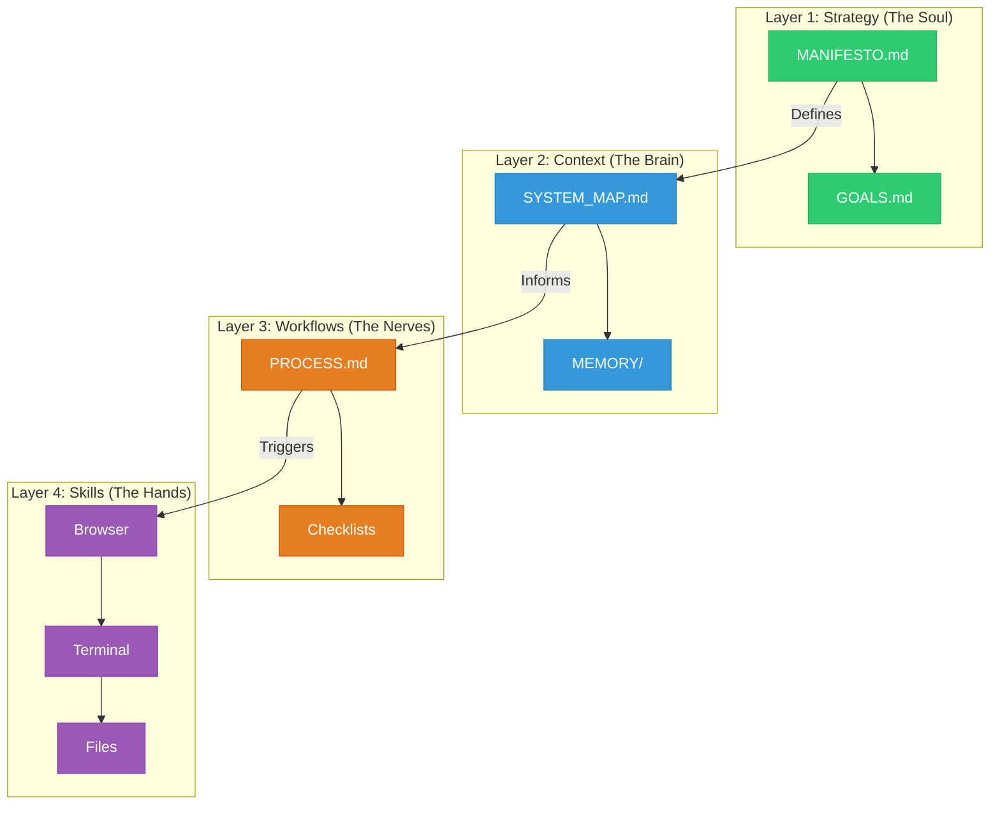

# Talos

> **The Operating System for the AI-Native Enterprise.**

  

**Talos** is a file-system based framework for building autonomous organizations.
It gives your AI Agents a **Body** (Infrastructure) and a **Soul** (Strategy).

<!-- GitHub Social Description: Talos: The File-System based Operating System for Autonomous AI Agents. Give your scripts a Soul and a Body. -->

---

## ⚡ The Problem: "Amnesiac Geniuses"

Most AI agents are toys.
*   They forget your context after 5 minutes.
*   They hallucinate when the task gets complex.
*   They drift away from your business goals.

This happens because they lack an **Operating System**. They are just scripts running in a void.

## 🛠️ The Solution: The 4 Immutable Layers

Talos provides a rigid, fractal architecture that forces agents to operate within strict boundaries.



### 1. Strategy (`talos/1_strategy/`)
The **Why**. Defined by Humans.
*   Contains the `MANIFESTO.md` (Vision) and `ROADMAP.md`.
*   *Rule*: Agents can read this, but never write to it.

### 2. Context (`talos/2_context/`)
The **What**. Managed by the Architect.
*   Contains the `SYSTEM_MAP.md` (Where data lives) and `memory/` (Logs).
*   *Rule*: If it's not in a file, it doesn't exist.

### 3. Workflows (`talos/3_workflows/`)
The **How**. The Engine.
*   Deterministic procedures (`onboarding.md`, `deploy.md`) that guide the agent step-by-step.
*   *Rule*: Never guess. Follow the workflow.

### 4. Skills (`talos/4_skills/`)
The **Tools**. The Capabilities.
*   Atomic units of work (`search_web`, `write_code`).
*   *Rule*: Skills are reusable across any workflow.

---

## 🚀 Quick Start in 3 Steps

Talos is a **Framework**, not a Library. You **inhabit** it.

### 1. Initialize
Clone this repository to start your new Organization.

```bash
git clone https://github.com/your-org/talos.git my-company-os
cd my-company-os
# Run the System Check
./talos.sh
```

### 2. Inject the Soul (The Interview)
Your new organization is empty. It needs a **Soul** (Mission, Values, Constraints).
Ask your AI Agent (Cursor, Windsurf, Cline) to run the init workflow:

> **"@Talos run init"**

The Agent will interview you and generate your `MANIFESTO.md`.

### 3. Build
Now that the machine has a soul, start building Workflows in `talos/3_workflows/`.
Remember: **Goals drive Workflows. Workflows trigger Skills.**

```bash
# Mac / Linux
./talos.sh check

# Windows
.\talos.ps1 check
```

---

## 📜 The Talos Ethos

We subscribe to **15 Immutable Laws** (see `talos/0_framework/PRINCIPLES.md`). The top 3:

1.  **The Map IS The Territory**: Documentation is compiled code. If the doc is wrong, the "code" is broken.
2.  **Evolution > Revolution**: We improve in place. We do not delete without migrating.
3.  **Silence is Golden**: Output > Chatter.

---

## 🤝 Contributing

We are opinionated. Please read [CONTRIBUTING.md](CONTRIBUTING.md) before opening a PR.

> **"Render unto the Agent the things that are Algorithm; render unto the Human the things that are Meaning."**
