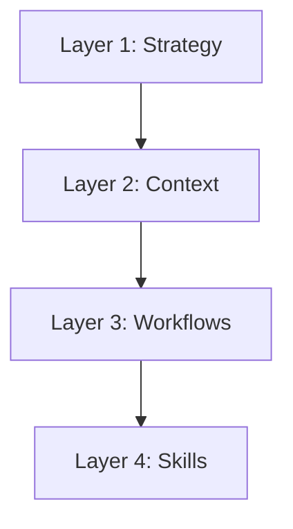

# Talos Architecture

> **"The Map is the Territory."**

This document defines the **4 Immutable Layers** of the Talos Framework.

## 1. The Organizational Layers

The architecture mirrors the folder structure perfectly:

### Layer 1: Strategy (`1_strategy/`)
*   **Purpose**: The Direction. Why do we exist? Where are we going?
*   **Owner**: The Captain (Human).
*   **Artifacts**:
    *   `talos/1_strategy/MANIFESTO.md`: Vision, Mission, Values (The Soul).
    *   `talos/1_strategy/GOALS_AND_ROADMAP.md`: Strategic targets.

### Layer 2: Context (`2_context/`)
*   **Purpose**: The Knowledge Base. The "Laws" and the "Map".
*   **Owner**: The Architect (Agent/Human).
*   **Artifacts**:
    *   `talos/2_context/SYSTEM_MAP.md`: Where data lives.
    *   `talos/2_context/BUSINESS_LOGIC.md`: Domain rules.
    *   `talos/2_context/memory/`: Active logs and state.
    *   `talos/2_context/standards/`: Technical protocols.

### Layer 3: Workflows (`3_workflows/`)
*   **Purpose**: The Engine. How work gets done.
*   **Owner**: The Crew (Agents).
*   **Artifacts**:
    *   `[Domain]_[Process].md`: Deterministic procedures.
    *   `WORKFLOW_MAP.md`: Dependency graph.

### Layer 4: Skills (`4_skills/`)
*   **Purpose**: The Tools. What we can do.
*   **Owner**: The Builders (Engineers).
*   **Artifacts**:
    *   `[Domain]/[Skill]/`: Autonomous capabilities.

## 2. The Universal Loop

Regardless of the task, the flow traverses the layers:

1.  **Input**: Request enters.
2.  **Filter (Strategy)**: Does this align with the Manifesto?
3.  **Plan (Context)**: Architect uses System Map to plan.
4.  **Execute (Workflows)**: Builder executes the Process.
5.  **Act (Skills)**: Process invokes Skills to touch reality.
6.  **Verify**: Verification steps ensure success.
7.  **Output**: Value delivered.

## 3. The Framework (`0_framework/`)

Surrounding these layers is the **Framework** itself (The Machine Manual).
*   It does not do work; it describes *how* the layers interact.
*   It contains the Protocols (`talos/0_framework/ROLES.md`, `talos/0_framework/PRINCIPLES.md`, `talos/0_framework/ESCALATION.md`).
