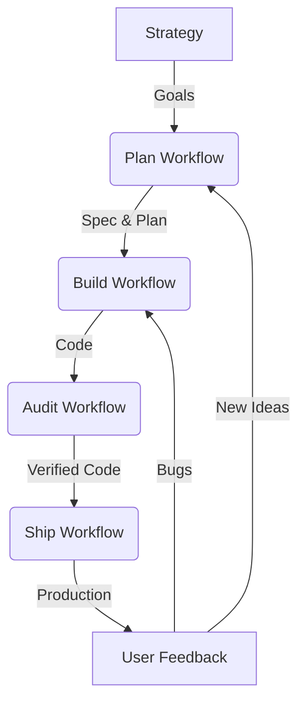

# Workflow Map (The Dependency Graph)

> **"How value flows through the system."**

## 1. The Strategy Loop
*   **Trigger**: Quarterly Start.
*   **Flow**:
    1.  `1_strategy/GOALS_AND_ROADMAP.md` is updated.
    2.  TRIGGERS -> **`plan.md`** (Create Implementation Plans for new goals).

## 2. The Development Loop
*   **Trigger**: **`plan.md`** completes.
*   **Flow**:
    1.  TRIGGERS -> **`build.md`** (Execute the code).
    2.  TRIGGERS -> **`audit.md`** (Verify the code).
    3.  TRIGGERS -> **`ship.md`** (Deploy the code).

## 3. The Feedback Loop
*   **Trigger**: **`ship.md`** completes (Production Incident or User Feedback).
*   **Flow**:
    1.  TRIGGERS -> **`intelligence/monitor_feedback.md`**.
    2.  If *Bug* -> TRIGGERS **`build.md`** (Fix).
    3.  If *Idea* -> TRIGGERS **`plan.md`** (New Feature).

